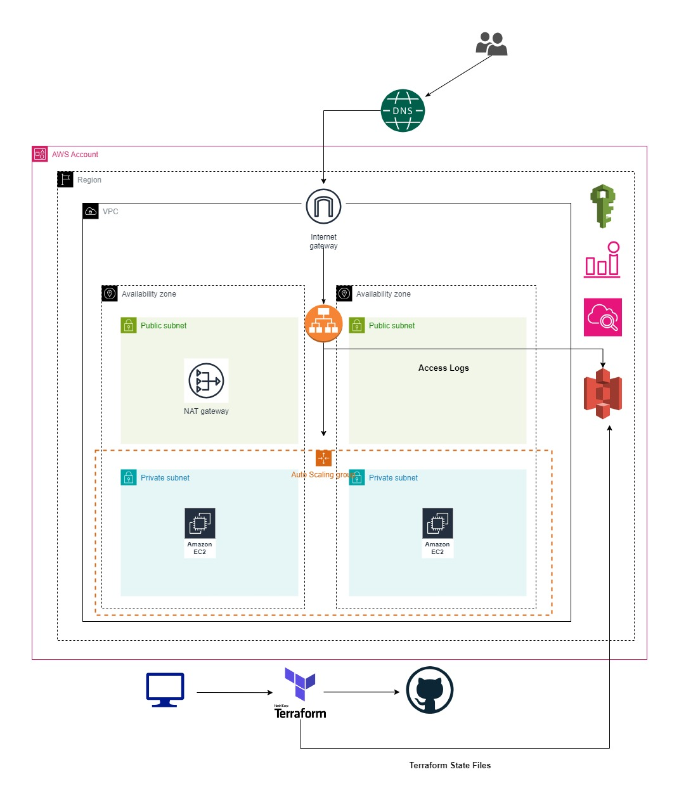
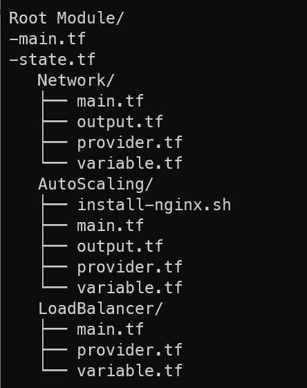

# Building AWS Auto Scaling Group with Application Load Balancer using Terraform for more Scalable and Reliable Solution

<h2>Project Overview</h2>
<p>This project represents an orchestrated deployment of a scalable and resilient cloud infrastructure on AWS using Terraform, a popular infrastructure as code (IaC) tool. The architecture revolves around three key modules: Network, Autoscaling, and Loadbalancer, each contributing to the establishment of a robust environment capable of handling varying workloads while ensuring high availability and fault tolerance.</p>



<h2>Description</h2>
<p>The project aimed to deploy a resilient , scalable and reliable AWS architecture using Terraform Infrastructure As Code (IaC) principles to streamline resource provisioning and management. Leveraging Terraform, the infrastructure was divided into three modular components: Network, Server, and Load Balancer.</p>

<h2>Pre-requisites</h2>
<p><b>Credentials:</b> Need AWS Configure
<p><b>S3 Bucket:</b> You need to have a S3 Bucket to store Terraform State Files</p>
<p><b>Certificate:</b> You need to request a certificate in AWS Certificate Manager to associate with Application Load Balancer</p>

AWS Certificate Manager References : https://medium.com/@wailinoo.2012/requesting-certificate-using-aws-certificate-manager-119f6ad8d2ab 

<h2>Module Structure</h2>



<h2>Terraform Command</h2>

```terraform
cd Network && terraform init
cd AutoScaling && terraform init
cd Load Balancer && terraform init

For Terraform Root Module:

terraform init
terraform validate
terraform plan
terraform apply --auto-approve
```

<h2>Network Module</h2>
<p>The Network module was responsible for creating the foundational components of the architecture within the VPC. This included defining the VPC itself, along with the associated subnets, route tables, and Internet Gateway. Two public subnets were designated for the ALB and one for NAT Gateway, while two private subnets were established across different availability zones to host the Auto Scaling Group with Desired 2 EC2 Instances.</p>

```terraform
module "network" {
  source = "./Network"
  vpc_cidr_block   = "10.200.0.0/16"
  vpcname = "wlo-terraform-vpc"
  subnet-name = "terraform-subnet"
  wlo-terraform-igw-name = "wlo-terraform-igw"
  natgw-name = "terraform-nat-gw"
  publicrtname = "public-subnet-routetable"
  privatertname = "private-subnet-routetable"
}
```

<p>In this module , I've used Terraform Function <b>cidrsubnet</b> to create 4 subnets.This function will generate subnetes with "10.200.0.0/24", "10.200.1.0/24", "10.200.2.0/24", "10.200.3.0/24".</p>
<p>You can play subnet ranges as you wish for least subnet ranges</p>

```terraform
locals {
  subnet = cidrsubnets(var.vpc_cidr_block,8,8,8,8)
}
```

<h2>AutoScalingGroup Module</h2>
<p>The Autoscaling module plays a crucial role in ensuring the scalability and reliability of the infrastructure by automatically adjusting the number of EC2 instances based on demand. By implementing dynamic scaling policies, it optimizes resource utilization, enhances fault tolerance, and maintains consistent performance levels, even during peak periods. Integrated with a Launch Template, it efficiently manages EC2 instance configurations, contributing to high availability and cost optimization. With automated scaling capabilities, the Autoscaling module simplifies infrastructure management while ensuring optimal performance and cost-effectiveness.</p>

```terraform
module "autoscalinggroup"{
    source = "./AutoScaling"
    vpcid = module.network.vpcid
    instance_type = "t2.micro"
    keypair = "wlo-keypair"
    lt-ingress-port = [22,80,443]
    template-name = "wlo-terraform-lt"
    device_name = "/dev/sdf"
    volume_size = 50
    image_id = "ami-0e5d58de654dfb50d"
    asg_tgb_name = "wlo-asg-tg-terraform"
    subnetid = module.network.subnetid
    asg_name = "wlo-asg-terraform"
    alarm_name = "wlo-asg-cpu-alarm"
    sns-topicname = "asg-terraform-sns"
    subcription_email = "wailinoo2012@gmail.com"
    desire_number = 2
    min_number = 2
    max_number = 4
}

```

<h2>Load Balancer Module</h2>
<p>The Load Balancer module was responsible for setting up the Application Load Balancer (ALB) to evenly distribute incoming traffic across EC2 Instances with Auto Scaling Group. This component defined the ALB listeners, target groups, and health checks to ensure efficient routing of requests to healthy instances.And aslso Secured Connection with AWS Certificate Manager.</p>

```terraform
module "loadbalancer" {
  source = "./LoadBalancer"
  public-subnetid = module.network.public-subnetid
  vpcid = module.network.vpcid
  alb-name = "asg-nginx-alb-wlo"
  asg-alblogs3 = "asg-albnginxlogs-wlo"
  sg-id = module.autoscalinggroup.sg-id
  asg-tg-arn = module.autoscalinggroup.asg-tg-arn
  certificate = "Your Certificate ARN"
}
```

<h2>Terraform State Management</h2>
<p>We are using S3 Bucket to store Terraform state files for the purpose of collaboration, version control, and consistency across teams by providing a centralized location for storing and sharing infrastructure state. This prevents conflicts and enables concurrent modifications to infrastructure as code while maintaining integrity and facilitating rollbacks when necessary.</p>

```terraform
terraform {
  backend "s3" {
    bucket         = "your S3 Bucket name to store state file"
    key            = "terraform.tfstate"  # Replace with a unique key for each configuration
    region         = "ap-southeast-1"
    encrypt        = true
    acl            = "private"
    #dynamodb_table = "terraform-lock"  # Optional: Use DynamoDB for state locking
  }
}
```

<h2>Conclusion</h2>
<p>In conclusion, the Network, Autoscaling, and Load Balancer modules collectively establish a resilient and scalable infrastructure on AWS. The Network configures essential components like VPC, subnets, and gateways, ensuring secure and efficient network communication. Autoscaling dynamically adjusts the EC2 instance count based on demand, optimizing resource utilization and maintaining consistent performance levels. Integrated with a Launch Template, it streamlines configuration management for enhanced reliability and cost efficiency. The Load Balancer module complements this setup by evenly distributing traffic across instances, ensuring high availability and efficient request routing. Together, these components provide a robust architecture that scales seamlessly to meet changing demands while maintaining reliability, performance, and cost-effectiveness.</p>
